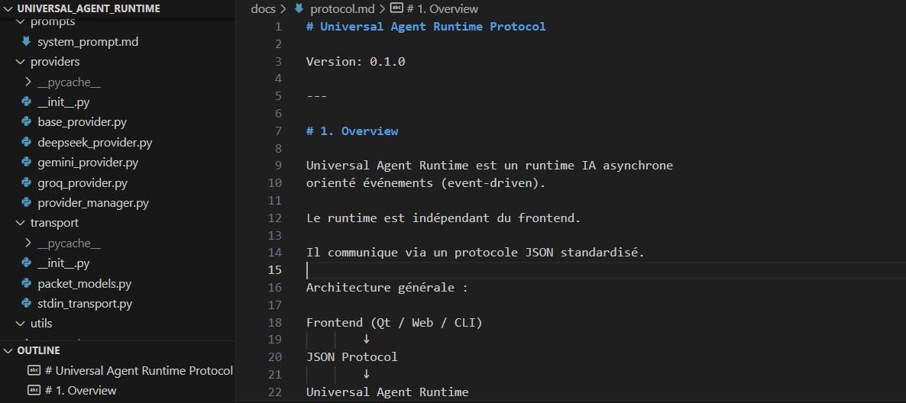

# Universal Agent Runtime Protocol

Version: 0.1.0

---

# 1. Overview

Universal Agent Runtime est un runtime IA asynchrone
orienté événements (event-driven).

Le runtime est indépendant du frontend.

Il communique via un protocole JSON standardisé.

Architecture générale :

Frontend (Qt / Web / CLI)
        ↓
JSON Protocol
        ↓
Universal Agent Runtime
        ↓
Providers (Groq, Gemini, etc.)

---

# 2. Goals

Ce protocole a pour objectifs :

- standardiser les échanges frontend/runtime
- permettre le streaming temps réel
- supporter plusieurs providers IA
- permettre l’ajout futur de tools/MCP
- rester transport-agnostic

Le protocole doit pouvoir fonctionner sur :

- stdin/stdout
- WebSocket
- TCP
- HTTP
- MCP transport

sans modification de la logique métier.

---

# 3. Packet Structure

Tous les échanges utilisent des packets JSON.

Structure minimale :

```json
{
    "id": "optional-request-id",
    "type": "request"
}
```

Champs :

| Champ | Type | Description |
|---|---|---|
| id | string/null | identifiant optionnel |
| type | string | type du packet |

Types supportés :

- request
- response
- event
- error

---

# 4. Request Packets

Les request packets représentent
une demande envoyée au runtime.

Structure :

```json
{
    "id": "req_001",
    "type": "request",
    "action": "chat.send",
    "payload": {}
}
```

Champs :

| Champ | Type | Description |
|---|---|---|
| id | string/null | identifiant optionnel |
| type | string | toujours "request" |
| action | string | action demandée |
| payload | object | données associées |

---

# 5. Response Packets

Les response packets représentent
une réponse finale du runtime.

Structure :

```json
{
    "id": "req_001",
    "type": "response",
    "status": "success",
    "payload": {}
}
```

Champs :

| Champ | Type | Description |
|---|---|---|
| id | string/null | identifiant lié à la request |
| type | string | toujours "response" |
| status | string | success ou error |
| payload | object | données réponse |

---

# 6. Event Packets

Les event packets représentent
des événements temps réel du runtime.

Ils servent principalement à :

- streaming
- progression
- thinking
- notifications runtime
- observabilité

Structure :

```json
{
    "type": "event",
    "event": "response.chunk",
    "payload": {}
}
```

Champs :

| Champ | Type | Description |
|---|---|---|
| type | string | toujours "event" |
| event | string | nom événement |
| payload | object | données événement |

---

# 7. Error Packets

Les error packets représentent
une erreur runtime.

Structure :

```json
{
    "type": "error",
    "message": "Provider unavailable"
}
```

Champs :

| Champ | Type | Description |
|---|---|---|
| type | string | toujours "error" |
| message | string | description erreur |

---

# 8. Supported Actions

Le runtime supporte actuellement
les actions suivantes.

---

## 8.1 runtime.configure

Configure dynamiquement le runtime.

IMPORTANT :
-------------
Cette action doit être appelée
avant tout chat.send.

Elle permet de configurer :

- providers
- clés API
- modèles
- prompt système

Exemple :

```json
{
    "type": "request",
    "action": "runtime.configure",
    "payload": {

        "system_prompt":
            "You are a helpful assistant.",

        "providers": [

            {
                "name": "groq",
                "api_key": "gsk_xxx",
                "model": "llama-3.3-70b-versatile"
            }

        ]
    }
}
```

Réponse :

```json
{
    "type": "response",
    "status": "success",
    "payload": {
        "message": "Runtime configured"
    }
}
```

---

## 8.2 chat.send

Envoie un message utilisateur au runtime.

Exemple :

```json
{
    "type": "request",
    "action": "chat.send",
    "payload": {
        "content": "Hello"
    }
}
```

Réponse finale :

```json
{
    "type": "response",
    "status": "success",
    "payload": {
        "content": "Hello human"
    }
}
```

IMPORTANT :
-------------
chat.send peut produire :

- des events streaming
- des events thinking
- une réponse finale

---

## 8.3 chat.reset

Réinitialise la conversation active.

Exemple :

```json
{
    "type": "request",
    "action": "chat.reset",
    "payload": {}
}
```

Réponse :

```json
{
    "type": "response",
    "status": "success",
    "payload": {
        "message": "Conversation reset"
    }
}
```

---

# 9. Supported Events

Le runtime utilise un système
orienté événements (event-driven).

Ces événements permettent :

- streaming temps réel
- synchronisation UI
- observabilité runtime
- debug
- monitoring

---

## 9.1 runtime.ready

Émis lorsque le runtime
est complètement initialisé.

Exemple :

```json
{
    "type": "event",
    "event": "runtime.ready",
    "payload": {}
}
```

Le frontend peut considérer
que le runtime est prêt.

---

## 9.2 request.received

Émis lorsqu’une request
est reçue par l’orchestrator.

Exemple :

```json
{
    "type": "event",
    "event": "request.received",
    "payload": {
        "action": "chat.send"
    }
}
```

---

## 9.3 thinking.started

Indique qu’une génération IA commence.

Exemple :

```json
{
    "type": "event",
    "event": "thinking.started",
    "payload": {
        "message": "AI generation started"
    }
}
```

Utilisation frontend :

- spinner
- animation
- état réflexion IA

---

## 9.4 response.chunk

Événement streaming principal.

Contient un fragment de texte généré.

Exemple :

```json
{
    "type": "event",
    "event": "response.chunk",
    "payload": {
        "chunk": "Hello"
    }
}
```

IMPORTANT :
-------------
Les chunks :

- n'ont PAS de taille fixe
- dépendent du provider
- peuvent être :
    - mots
    - morceaux de mots
    - ponctuation
    - phrases

Le frontend doit concaténer
les chunks reçus.

---

## 9.5 thinking.finished

Indique la fin de génération IA.

Exemple :

```json
{
    "type": "event",
    "event": "thinking.finished",
    "payload": {
        "message": "AI generation completed"
    }
}
```

---

## 9.6 response.completed

Émis lorsque la génération complète
est terminée.

Exemple :

```json
{
    "type": "event",
    "event": "response.completed",
    "payload": {
        "content": "Final generated response"
    }
}
```

---

## 9.7 conversation.reset

Émis après reset conversationnel.

Exemple :

```json
{
    "type": "event",
    "event": "conversation.reset",
    "payload": {}
}
```

---

## 9.8 runtime.error

Émis lorsqu’une erreur runtime survient.

Exemple :

```json
{
    "type": "event",
    "event": "runtime.error",
    "payload": {
        "message": "Provider unavailable"
    }
}
```

---

# 10. Runtime Lifecycle

Le runtime suit un cycle de vie précis.

Cycle général :

```text
START
  ↓
runtime.ready
  ↓
runtime.configure
  ↓
chat.send
  ↓
thinking.started
  ↓
response.chunk
  ↓
response.chunk
  ↓
response.completed
  ↓
thinking.finished
  ↓
response packet final
```

---

# 11. Runtime State

Le runtime possède un état interne centralisé.

Actuellement :

```python
RuntimeState
```

Responsabilités :

- stocker si le runtime est configuré
- stocker le provider actif
- stocker le prompt système
- stocker l’état générationnel
- préparer le support multi-session futur

Exemple conceptuel :

```python
runtime_state.is_configured
runtime_state.active_provider
runtime_state.system_prompt
runtime_state.is_generating
```

IMPORTANT :
-------------
Le frontend ne doit PAS supposer
les états internes runtime.

Le frontend doit uniquement
réagir aux events reçus.

Architecture correcte :

```text
Runtime State
    ↓
Events
    ↓
Frontend UI
```

et NON :

```text
Frontend devine état runtime
```

---

# 12. Streaming Flow

Le runtime supporte le streaming temps réel.

Le provider peut envoyer
des fragments progressifs de génération.

Flux complet :

```text
Frontend
    ↓
chat.send
    ↓
Runtime
    ↓
Provider streaming
    ↓
response.chunk
    ↓
response.chunk
    ↓
response.chunk
    ↓
response.completed
```

---

## 12.1 Frontend Responsibilities

Le frontend doit :

- accumuler les chunks
- afficher progressivement le texte
- gérer les états thinking
- gérer erreurs runtime
- gérer reset conversationnel

Pseudo-code frontend :

```cpp
if(event == "response.chunk")
{
    currentMessage += chunk;
    ui->appendChunk(chunk);
}
```

---

## 12.2 Chunk Semantics

IMPORTANT :
-------------
Les chunks ne représentent PAS :

- forcément des mots
- forcément des tokens exacts
- forcément des phrases

Les providers décident librement.

Exemples possibles :

```text
"He"
"llo"
","
" world"
```

ou :

```text
"Hello world"
```

Le frontend doit uniquement concaténer.

---

## 12.3 Why Streaming Matters

Le streaming améliore :

- perception vitesse
- UX
- feedback utilisateur
- impression intelligence
- fluidité conversationnelle

Les systèmes modernes utilisent tous :

- streaming
- events
- génération progressive

---

# 13. Error Handling

Les erreurs peuvent provenir de :

- transport
- JSON invalide
- provider
- timeout
- réseau
- configuration runtime
- événements internes

Le runtime tente toujours :

- d’éviter le crash
- de retourner ErrorPacket
- d’émettre runtime.error

---

## 13.1 Transport Errors

Exemple :

```json
{
    "type": "error",
    "message": "Invalid JSON packet"
}
```

---

## 13.2 Provider Errors

Exemple :

```json
{
    "type": "event",
    "event": "runtime.error",
    "payload": {
        "message": "Groq API unavailable"
    }
}
```

---

# 14. Current Limitations

Version actuelle :

- mono-session
- mono-utilisateur
- pas de cancellation
- pas de queue requests
- pas de persistence mémoire
- pas de tool calling
- pas de vision
- pas de MCP natif

---

# 15. Planned Extensions

Extensions prévues :

- request ids complets
- cancellation tokens
- stop generation
- queue système
- memory persistence
- tool calling
- MCP integration
- multi-session runtime
- websocket transport
- binary payloads
- vision packets
- audio streaming
- observability metrics
- plugin system

---

# 16. Architecture Philosophy

Le runtime suit plusieurs principes :

- séparation des responsabilités
- architecture modulaire
- event-driven architecture
- provider abstraction
- transport abstraction
- async-first design

Le runtime doit rester indépendant :

- du frontend
- du provider IA
- du transport réseau
- des tools
- du système d’exploitation

Objectif :

construire un runtime agentique
scalable et extensible.

---

# 17. Complete Conversation Example

Exemple complet de communication.

---

## 17.1 Runtime Startup

Le runtime démarre.

Événement envoyé :

```json
{
    "type": "event",
    "event": "runtime.ready",
    "payload": {}
}
```

---

## 17.2 Runtime Configuration

Frontend → Runtime :

```json
{
    "type": "request",
    "action": "runtime.configure",
    "payload": {

        "system_prompt":
            "You are a helpful assistant.",

        "providers": [

            {
                "name": "groq",
                "api_key": "gsk_xxx",
                "model": "llama-3.3-70b-versatile"
            }

        ]
    }
}
```

Runtime → Frontend :

```json
{
    "type": "response",
    "status": "success",
    "payload": {
        "message": "Runtime configured"
    }
}
```

---

## 17.3 Chat Message

Frontend → Runtime :

```json
{
    "type": "request",
    "action": "chat.send",
    "payload": {
        "content": "Hello"
    }
}
```

---

## 17.4 Streaming Events

Runtime → Frontend :

```json
{
    "type": "event",
    "event": "thinking.started",
    "payload": {}
}
```

Puis :

```json
{
    "type": "event",
    "event": "response.chunk",
    "payload": {
        "chunk": "Hel"
    }
}
```

Puis :

```json
{
    "type": "event",
    "event": "response.chunk",
    "payload": {
        "chunk": "lo"
    }
}
```

Puis :

```json
{
    "type": "event",
    "event": "response.completed",
    "payload": {
        "content": "Hello human"
    }
}
```

Puis :

```json
{
    "type": "event",
    "event": "thinking.finished",
    "payload": {}
}
```

Puis réponse finale :

```json
{
    "type": "response",
    "status": "success",
    "payload": {
        "content": "Hello human"
    }
}
```

---

# 18. Transport Abstraction

Le runtime est indépendant du transport utilisé.

Actuellement :

```text
stdin/stdout
```

Mais le protocole peut fonctionner sur :

- WebSocket
- TCP
- HTTP
- Named Pipes
- MCP transport
- local sockets

IMPORTANT :
-------------
Le protocole JSON reste identique.

Seul le transport change.

---

# 19. Provider Abstraction

Le runtime utilise une abstraction provider.

Interface conceptuelle :

```python
BaseProvider
```

Chaque provider implémente :

```python
initialize()
generate_response()
stream_response()
reset_conversation()
is_available()
```

Cela permet de supporter :

- Groq
- Gemini
- OpenAI
- Claude
- Ollama
- DeepSeek
- providers futurs

sans modifier l’orchestrator.

---

# 20. Event-Driven Philosophy

Le runtime est orienté événements.

Pourquoi ?

Parce que les systèmes IA modernes nécessitent :

- streaming
- observabilité
- états runtime
- progression temps réel
- outils asynchrones

Le runtime utilise donc :

```text
EventBus
    ↓
EventForwarder
    ↓
Transport
    ↓
Frontend
```

Cette architecture permet :

- découplage fort
- extensibilité
- debugging facilité
- monitoring futur

---

# 21. Future MCP Integration

Le runtime est conçu pour
une future intégration MCP.

Pourquoi ?

Parce que l’architecture actuelle possède déjà :

- transport abstrait
- protocole standardisé
- provider abstraction
- event system
- orchestration centrale

L’intégration MCP future pourra donc :

- exposer tools
- exposer ressources
- connecter agents externes

sans refactor massif.

---